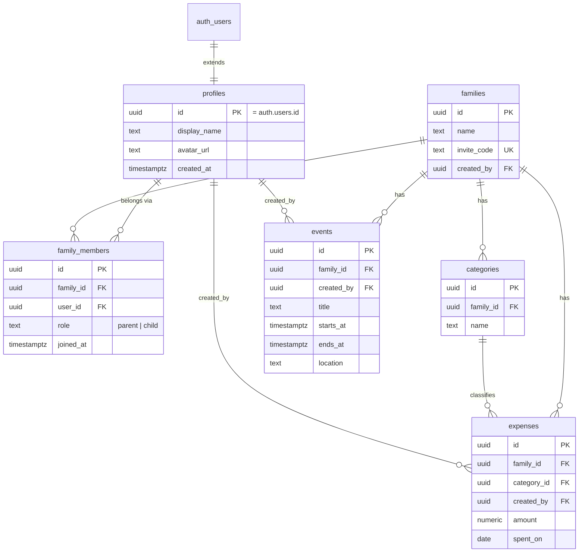

# FamWeave

FamWeave is a multi-tenant family management web app. Each family is an isolated tenant with its own members, calendar events, and expense tracking. Built as a capstone project for the SoftUni "Software Technologies with AI" course using AI-assisted development.

## Live Demo

Live URL: [https://famweave.netlify.app](https://famweave.netlify.app)

| Role | Email | Password |
|---|---|---|
| Parent (full access + admin panel) | `demo.parent@famweave.app` | `FamWeaveDemo26!` |
| Child (read-only access) | `demo.child@famweave.app` | `FamWeaveDemo26!` |

## Roles

FamWeave has two roles, stored per membership on `family_members.role`:

- **parent** — full CRUD on events and expenses, plus the admin panel: manage family members, promote/demote roles, and view the invite code.
- **child** — read-only access to family data (calendar, expenses); can manage their own profile and avatar.

This implements the assignment requirement for "an admin panel or similar concept for special users, different from regular." Role enforcement happens **server-side**, via RLS policies and database triggers — the UI (hiding buttons, redirecting non-parents away from `admin.html`) only mirrors these restrictions and is never the actual security boundary.

## Tech Stack

- **[Vite](https://vitejs.dev/)** `^8.1.1` — multi-page build (one Rollup input per HTML screen)
- **Vanilla JavaScript** (ES modules) — no frontend framework, no TypeScript
- **[Bootstrap](https://getbootstrap.com/)** `^5.3.8` + **Bootstrap Icons** `^1.13.1`
- **[Supabase](https://supabase.com/)** (via `@supabase/supabase-js` `^2.110.0`) — PostgreSQL, Auth, Storage, Row Level Security
- **[Netlify](https://www.netlify.com/)** — static hosting and deployment

## Architecture

FamWeave is a **multi-page application**: every screen is its own root-level HTML file (`dashboard.html`, `calendar.html`, `expenses.html`, ...), each registered as a separate Vite build entry, with a matching entry script in `src/pages/<name>-page.js`. There is no client-side router and no SPA shell.

- **`src/core/`** — shared infrastructure: the Supabase client singleton (`supabase.js`), the session/auth guard and family lookup (`auth.js`), and shared UI helpers — navbar, `escapeHtml`, `showAlert` (`ui.js`).
- **`src/services/`** — one file per domain (`family-service.js`, `event-service.js`, `expense-service.js`, `profile-service.js`). These are the *only* files that import the Supabase client; page scripts call services, never Supabase directly.
- **`src/pages/`** — one `<name>-page.js` per HTML screen: DOM wiring, form handling, and rendering, built on top of `core/` and `services/`.

Client and server communicate over the **Supabase REST API (PostgREST)** using the public anon key — there is no custom backend. The anon key is safe to expose because it grants no privileges on its own; **Row Level Security is the actual security boundary**, enforced by Postgres on every query regardless of which client sent it.

`.github/copilot-instructions.md` holds the AI agent instructions for this repo — conventions, layering rules, and scope boundaries that Claude/Copilot follow when making changes here.

## Database Schema



`profiles` extends `auth.users` 1:1 — `auth.users` itself is managed entirely by Supabase Auth (not a table this project migrates or owns); `profiles.id` is both its primary key and a foreign key to `auth.users.id`.

### Migrations

Schema changes are versioned as sequential SQL files in `supabase/migrations/` (`001` through `007`), applied manually via the Supabase SQL Editor, and committed to the repo as the single source of truth for the schema. `supabase/seed-demo.sql` seeds demo data for the accounts above and is intentionally **not** a migration — it's a one-off script, not part of the schema history.

## Security

- Supabase Auth with JWT-based sessions.
- Row Level Security policies on every table, enforcing both family isolation (a user only ever sees rows from their own family) and role-based write access (only `parent` can write to events/expenses/categories/family membership).
- `security definer` helper functions (`is_family_member`, `is_family_parent`, etc.) with a pinned `search_path`, used consistently across policies.
- A database trigger that blocks removing or demoting the last remaining parent of a family, with a transaction-scoped advisory lock to close the race window between two concurrent role changes.
- XSS protection via a single shared `escapeHtml` helper applied to all user-generated content before it's interpolated into the DOM.

Access control was verified with negative access-control tests using both the parent and child demo accounts — confirming child-role writes are rejected server-side, not just hidden in the UI.

## Local Development

```bash
git clone <repo-url>
cd fam-weave
npm install
```

Create a `.env` file in the project root with:

```
VITE_SUPABASE_URL=
VITE_SUPABASE_ANON_KEY=
```

Then start the dev server:

```bash
npm run dev
```

For a production build (output to `dist/`):

```bash
npm run build
```

## Project Structure

```
/
├── admin.html, calendar.html, dashboard.html,   # one HTML file per screen —
│   expenses.html, index.html, login.html,       # each a separate Vite entry
│   onboarding.html, profile.html, register.html
├── src/
│   ├── pages/          # one <name>-page.js entry script per HTML screen
│   ├── core/            # supabase.js, auth.js, ui.js — shared infrastructure
│   ├── services/        # family-service.js, event-service.js,
│   │                     # expense-service.js, profile-service.js
│   └── styles/          # main.css — global styles
├── supabase/
│   ├── migrations/       # 001-007, sequential schema history
│   ├── seed-demo.sql     # demo data script (not a migration)
│   └── cleanup-test-data.sql
├── docs/                 # ARCHITECTURE.md, DATABASE.md, DECISIONS.md (ADRs),
│                          # PRODUCT_SPEC.md
├── .github/
│   └── copilot-instructions.md   # AI agent instructions for this repo
├── netlify.toml
└── vite.config.js
```

## Scope and Future Work

V1 covers authentication, families with invite-code onboarding, a shared calendar, expense tracking with categories, avatar uploads, and a parent-only admin panel. Planned future modules include Home Inventory, Documents, and an AI Assistant.