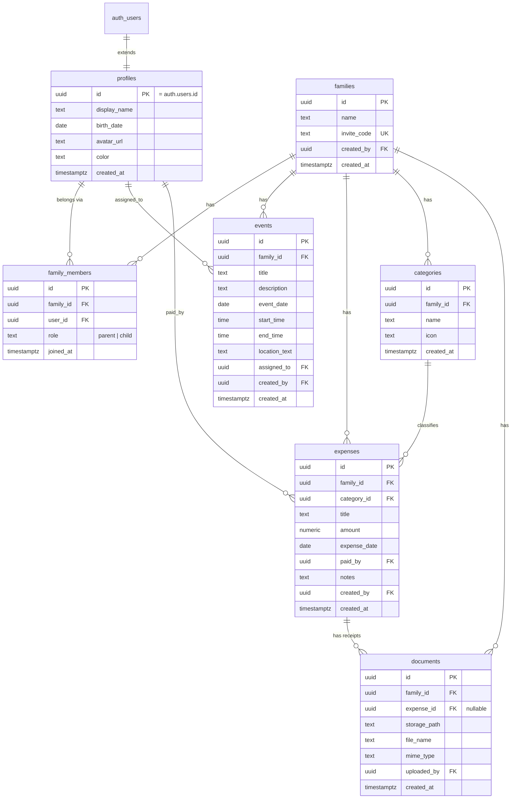

# FamWeave — Database Design

Schema is managed **exclusively** through SQL migrations in `supabase/migrations/` (ADR-005). All identifiers are `snake_case`. All domain tables carry `family_id` (ADR-003).

## ER Diagram

## Tables

### profiles
Extends `auth.users` 1:1 (same `id`). Created automatically by a trigger on user sign-up. Holds display data: name, birth date (used to suggest a default role for minors), avatar URL (Storage path), personal color used across calendar and expense views.

### families
The tenant. `invite_code` is a short unique code (e.g. 8 chars) used for joining; regenerate-able by a parent. `created_by` references the founding user.

### family_members
Junction table user↔family with `role` (`parent` | `child`). `UNIQUE (family_id, user_id)`. Role lives here — not on the profile — because role is family-scoped (ADR-004). V1 uses one family per user; the schema already supports several.

### categories
Expense categories, **per family** (each family manages its own list). Seeded with sensible defaults (Food, Education, Sport, Health, Other) on family creation.

### events
Calendar entries. `assigned_to` optionally points to the member the event concerns (child pickup, training). Times stored as local `date` + `time` columns — no timestamptz for user-facing scheduling, avoiding timezone-shift bugs.

### expenses
`amount` is `numeric(10,2)`. `paid_by` references the paying member. Currency is a single family-wide assumption (EUR) in V1 — no per-row currency column until a real need appears.

### documents
File metadata; binary lives in a Supabase Storage bucket under `family/{family_id}/...`. `expense_id` nullable: V1 attaches documents to expenses, but the table deliberately allows unattached documents so V3 (warranties, vault) extends it with new nullable FKs instead of a new table.

## Relationships (summary)

- `profiles` 1—1 `auth.users`; `profiles` M—N `families` through `family_members`.
- `families` 1—N `events`, `expenses`, `categories`, `documents`.
- `categories` 1—N `expenses` (`ON DELETE SET NULL` so deleting a category never deletes expenses).
- `expenses` 1—N `documents` (`ON DELETE CASCADE` for the metadata; storage objects removed by the service).

## Indexes

- Every FK column: `family_id` on all domain tables (the hot filter), `category_id`, `expense_id`, `user_id`.
- `events (family_id, event_date)` — calendar month queries.
- `expenses (family_id, expense_date)` — expense lists and monthly summaries.
- `families (invite_code)` — unique index, join-by-code lookup.
- `family_members (family_id, user_id)` — unique composite.

## RLS

Every table: RLS enabled, deny by default. Standard template per table — `SELECT` gated by `is_family_member(family_id)`, `INSERT/UPDATE/DELETE` gated by `is_family_parent(family_id)` — plus documented exceptions for `profiles`, `families`, `family_members` (see ARCHITECTURE.md, "RLS Philosophy").

## Future Extensibility

- **V1.5 recurring:** new tables `recurring_events` / `recurring_expenses` that *generate* rows into existing tables — no changes to `events`/`expenses`.
- **V2 inventory:** new tables `rooms`, `items` with the same `family_id` + RLS template; `documents` gains nullable `item_id`.
- **V3 warranties:** `warranties` table referencing `items` and `documents`; expiry reminders read existing data.
- **V4 AI:** no schema of its own initially — reads/writes through the same services; later an `ai_actions` audit table if needed.
- Pattern: **new capability = new table(s) + nullable FK links**, never restructuring existing tables.