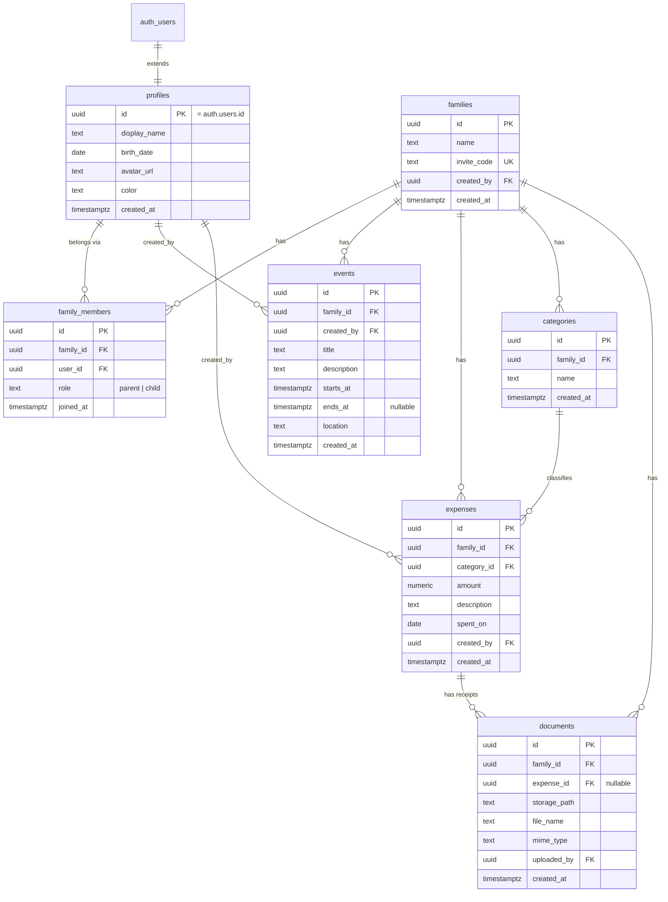

# FamWeave — Database Design

Schema is managed **exclusively** through SQL migrations in `supabase/migrations/` (ADR-005). All identifiers are `snake_case`. All domain tables carry `family_id` (ADR-003).

## ER Diagram

## Tables

### profiles
Extends `auth.users` 1:1 (same `id`). Created automatically by a trigger on user sign-up. Holds display data: name, birth date (used to suggest a default role for minors), avatar URL (full public URL, see Storage section), personal color used across calendar and expense views.

### families
The tenant. `invite_code` is a short unique code (e.g. 8 chars) used for joining; regenerate-able by a parent. `created_by` references the founding user.

### family_members
Junction table user↔family with `role` (`parent` | `child`). `UNIQUE (family_id, user_id)`. Role lives here — not on the profile — because role is family-scoped (ADR-004). V1 uses one family per user; the schema already supports several. Protected by trigger `trg_last_parent_protection`, which blocks demoting or deleting a family's last parent (ADR-015); it skips the check during the `families` row's own `ON DELETE CASCADE`, and takes a per-family advisory lock to serialize concurrent role changes.

### categories
Per-family expense categories: `id`, `family_id` FK → `families(id)` (`ON DELETE CASCADE`), `name`, `created_at`. `UNIQUE (family_id, name)` — each family manages its own list, no duplicates within a family. RLS follows the standard template: `SELECT` for any family member, `INSERT/UPDATE/DELETE` restricted to parents. Five defaults (`Храна`, `Сметки`, `Транспорт`, `Здраве`, `Друго`) are seeded per family rather than left empty — inserted by the `create_family` RPC at creation time, and backfilled for every family that already existed when migration 003 ran (ADR-011).

### events
Calendar entries: `id`, `family_id` FK → `families(id)` (`ON DELETE CASCADE`), `created_by` FK → `profiles(id)`, `title` (`CHECK (char_length(trim(title)) > 0)`), `description` (optional), `starts_at` timestamptz, `ends_at` timestamptz (optional; `CHECK (ends_at IS NULL OR ends_at > starts_at)`, named `events_ends_after_starts`), `location` (optional), `created_at`. Indexed on `(family_id, starts_at)` for upcoming-event queries. RLS follows the standard template: `SELECT` for any family member, `INSERT/UPDATE/DELETE` restricted to parents; the `INSERT` policy additionally requires `created_by = auth.uid()`.

### expenses
`id`, `family_id` FK → `families(id)` (`ON DELETE CASCADE`), `category_id` FK → `categories(id)` (`ON DELETE RESTRICT` — a category with logged expenses cannot be deleted, protecting expense history from silent loss), `amount` `numeric(10,2)` with `CHECK (amount > 0)`, `description` (optional), `spent_on` date (defaults to `current_date`), `created_by` FK → `profiles(id)`, `created_at`. Indexed on `(family_id, spent_on DESC)` for expense-list and monthly-summary queries. RLS follows the standard template: `SELECT` for any family member, `INSERT/UPDATE/DELETE` restricted to parents. Currency is a single family-wide assumption (EUR) in V1 — no per-row currency column until a real need appears (ADR-010).

### documents
File metadata; binary lives in a Supabase Storage bucket under `family/{family_id}/...`. `expense_id` nullable: V1 attaches documents to expenses, but the table deliberately allows unattached documents so V3 (warranties, vault) extends it with new nullable FKs instead of a new table.

## Relationships (summary)

- `profiles` 1—1 `auth.users`; `profiles` M—N `families` through `family_members`.
- `families` 1—N `events`, `expenses`, `categories`, `documents`.
- `categories` 1—N `expenses` (`ON DELETE RESTRICT` — deleting a category with logged expenses is blocked, not silently nulled).
- `expenses` 1—N `documents` (`ON DELETE CASCADE` for the metadata; storage objects removed by the service).

## Indexes

- Every FK column: `family_id` on all domain tables (the hot filter), `category_id`, `expense_id`, `user_id`.
- `events (family_id, starts_at)` — upcoming-events queries.
- `expenses (family_id, spent_on DESC)` — expense lists and monthly summaries.
- `families (invite_code)` — unique index, join-by-code lookup.
- `family_members (family_id, user_id)` — unique composite.

## RLS

Every table: RLS enabled, deny by default. Standard template per table — `SELECT` gated by `is_family_member(family_id)`, `INSERT/UPDATE/DELETE` gated by `is_family_parent(family_id)` — plus documented exceptions for `profiles`, `families`, `family_members` (see ARCHITECTURE.md, "RLS Philosophy").

## Storage

- **Bucket `avatars`** (public), created in migration 005. Path convention: `{user_id}/avatar.{ext}`, `ext` restricted client-side to `jpg`, `jpeg`, `png`, `webp`, `gif`.
- **RLS policies on `storage.objects`**, scoped to `bucket_id = 'avatars'`, ownership checked via `(storage.foldername(name))[1] = auth.uid()::text` (the first path segment, i.e. the uploading user's id):
  - `avatars_select_public` — anyone can read any file in the bucket (public avatars; no `to` role restriction).
  - `avatars_insert_own` — `authenticated` users may upload only into their own `{user_id}/` folder.
  - `avatars_update_own` — `authenticated` users may update only their own files.
  - `avatars_delete_own` — `authenticated` users may delete only their own files.
- **`profiles.avatar_url`** stores the full public URL returned by `storage.from('avatars').getPublicUrl(...)`, with a `?v=<timestamp>` cache-busting query param appended on every upload (ADR-014).

## Future Extensibility

- **V1.5 recurring:** new tables `recurring_events` / `recurring_expenses` that *generate* rows into existing tables — no changes to `events`/`expenses`.
- **V2 inventory:** new tables `rooms`, `items` with the same `family_id` + RLS template; `documents` gains nullable `item_id`.
- **V3 warranties:** `warranties` table referencing `items` and `documents`; expiry reminders read existing data.
- **V4 AI:** no schema of its own initially — reads/writes through the same services; later an `ai_actions` audit table if needed.
- Pattern: **new capability = new table(s) + nullable FK links**, never restructuring existing tables.